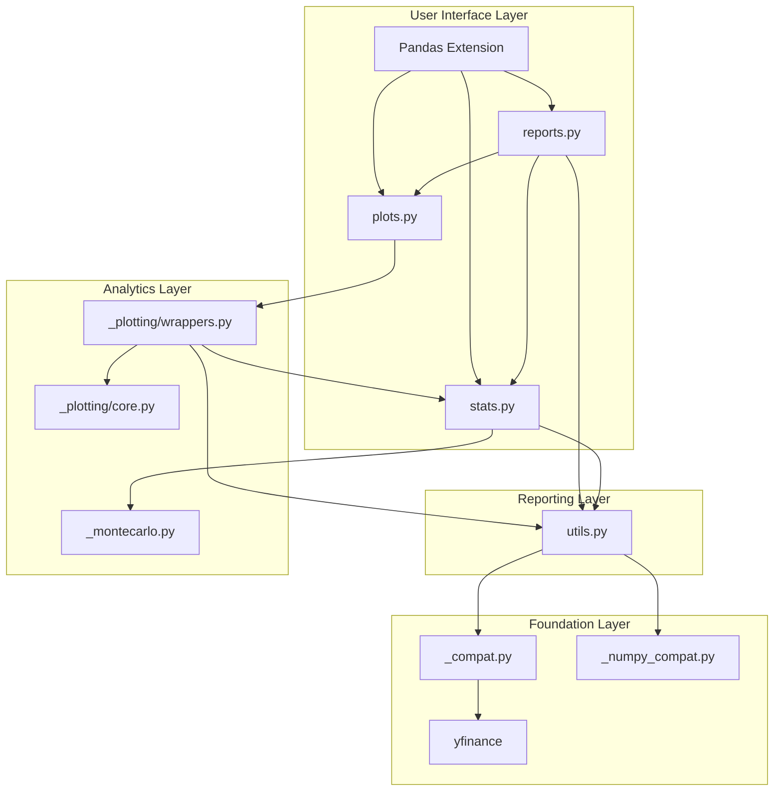
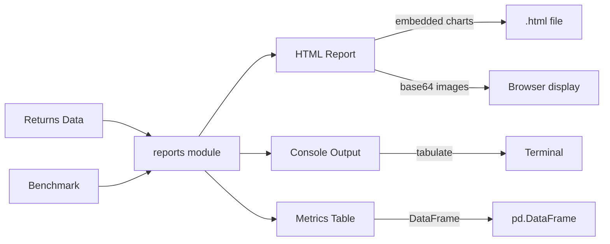
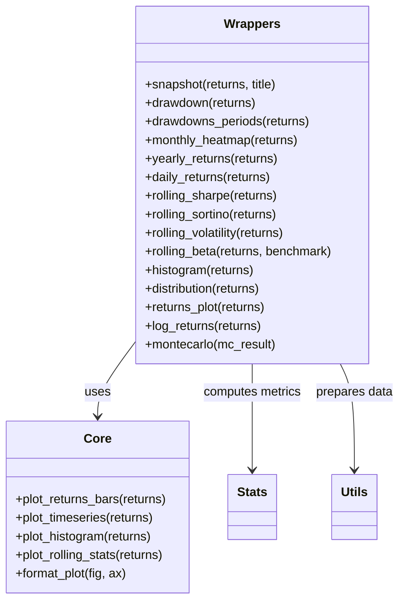
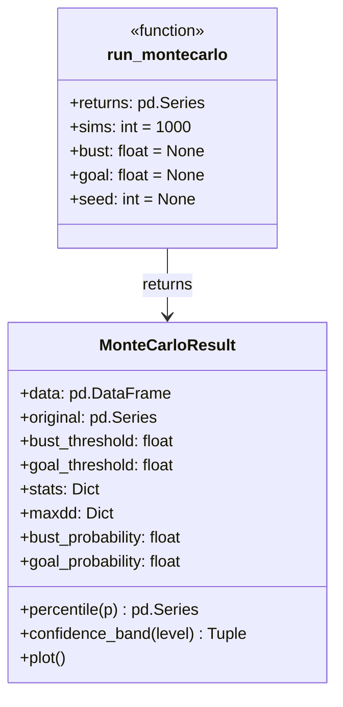
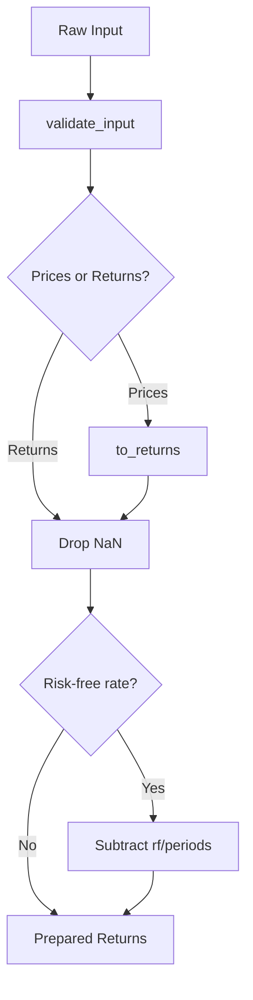
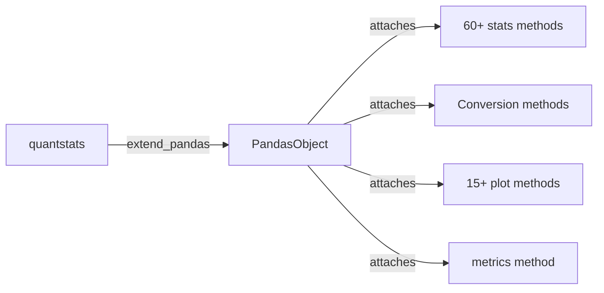

# QuantStats Architecture

## System Architecture Overview

QuantStats is organized as a layered functional library with four main modules:



## Trading Paradigm & Key Features

| Feature | Support | Details |
|---------|---------|---------|
| Backtesting Approach | None | Analytics/reporting library only; no backtesting engine |
| Live Trading | No | No execution or order management capabilities |
| Paper Trading | No | Not applicable -- analytics library |
| Multi-Asset | Yes | Asset-agnostic; operates on any pandas return series |
| Data Feeds | Yahoo Finance | Built-in yfinance integration for benchmark data download |
| ML Integration | No | No ML capabilities; purely statistical analysis and visualization |
| Risk Management | None | Computes risk metrics (VaR, CVaR, drawdown) but does not manage risk |
| Optimization | No | No optimization; Monte Carlo simulation for robustness analysis |
| Execution | None | No execution capabilities; post-hoc performance analysis only |

## Module Responsibilities

### stats.py -- Statistical Engine

The largest module, containing 60+ pure functions for financial metric computation. All functions follow a consistent pattern:

```python
def metric_name(
    returns: pd.Series | pd.DataFrame,
    rf: float = 0.0,                    # risk-free rate
    periods: int = 252,                 # annualization factor
    prepare_returns: bool = True,       # auto-prepare returns
    **kwargs
) -> float | pd.Series:
```

Key design decisions:
- All functions accept both Series and DataFrame inputs
- Returns are automatically prepared (NaN handling, type conversion) via `prepare_returns` flag
- Annualization is configurable via `periods` parameter (252=daily, 12=monthly, etc.)
- Functions are stateless -- no side effects

### reports.py -- Report Generation

Two output modes:



### _plotting/ -- Visualization System

Two-layer architecture:

- **wrappers.py**: High-level API functions (e.g., `snapshot()`, `drawdown()`, `monthly_heatmap()`)
- **core.py**: Low-level matplotlib rendering with consistent styling



### _montecarlo.py -- Monte Carlo Engine



The Monte Carlo engine:
1. Takes historical returns as input
2. Generates N simulated paths by shuffling returns (preserves distribution, breaks temporal structure)
3. Computes cumulative returns for all paths
4. Returns a `MonteCarloResult` dataclass with statistics, drawdown analysis, and visualization

### utils.py -- Data Preparation

Core responsibilities:
- `_prepare_returns()` -- Normalize input data (handle prices vs returns, NaN cleanup, risk-free rate adjustment)
- `validate_input()` -- Input validation with custom exceptions
- Return type conversions: `to_returns()`, `to_prices()`, `to_log_returns()`
- Resampling: `aggregate_returns()`, time period helpers (`_mtd`, `_qtd`, `_ytd`)
- Caching: Thread-safe cache for `_prepare_returns()` with LRU eviction



## Pandas Extension Architecture

`extend_pandas()` patches PandasObject to add QuantStats methods:



After calling `extend_pandas()`:
```python
df.sharpe()           # calls stats.sharpe(df)
df.plot_snapshot()    # calls plots.snapshot(df)
df.monthly_returns()  # calls stats.monthly_returns(df)
```

## Error Handling

Custom exception hierarchy:

```
QuantStatsError (base)
    DataValidationError   # Invalid input data
    CalculationError      # Computation failure
    PlottingError         # Chart rendering failure
    BenchmarkError        # Benchmark data issues
```

## Lazy Import Pattern

Reports and plotting modules use lazy imports to avoid circular dependencies:

```python
_stats = None
def _get_stats():
    global _stats
    if _stats is None:
        from . import stats
        _stats = stats
    return _stats
```

This pattern is used because `stats`, `reports`, and `plots` all reference each other.

---
## See Also
- [README](README.md) — Project overview and quick start
- [Workflow](workflow.md) — Event flows and processing pipelines
- [State Management](state-management.md) — State lifecycle and data models
- [Development](development.md) — Development guide and best practices
