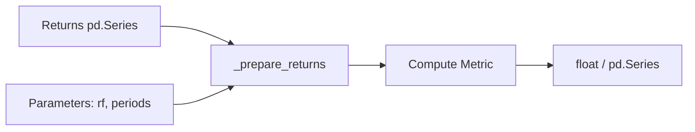
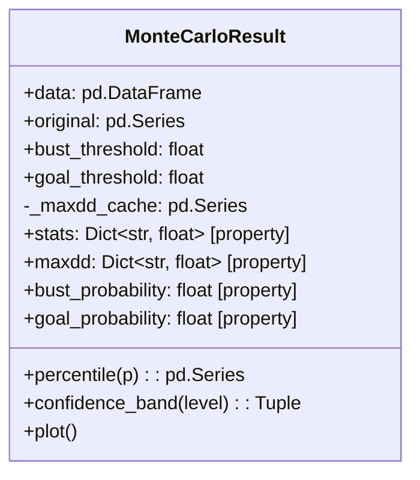
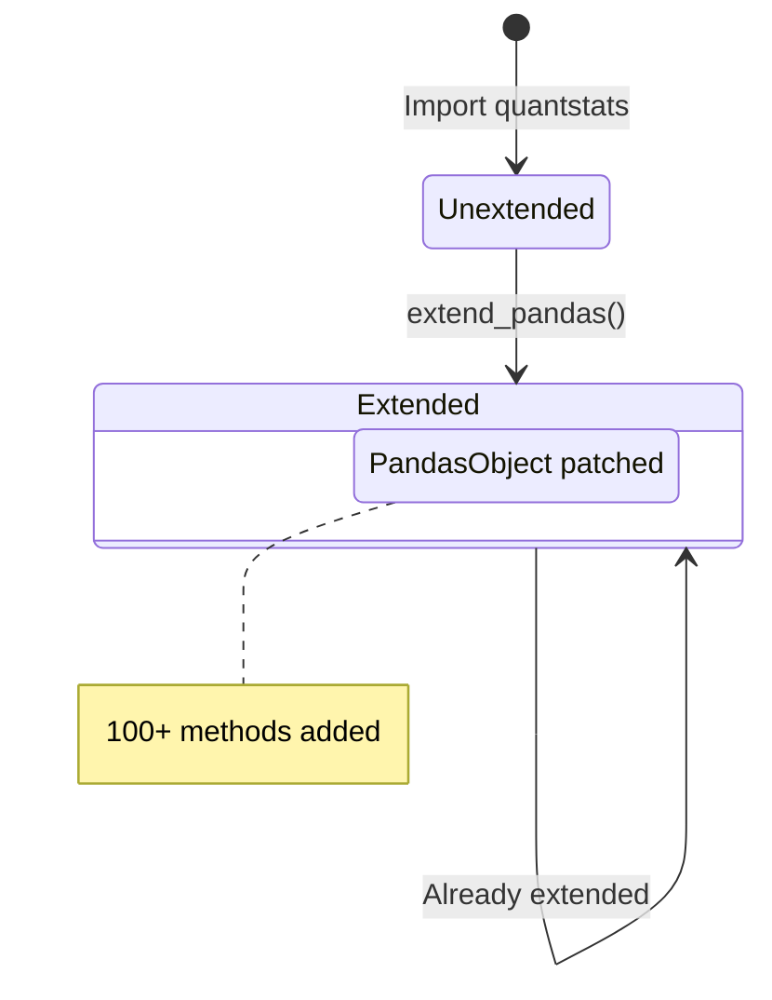
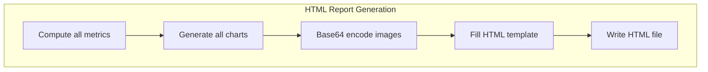

# QuantStats State Management

## Overview

QuantStats is a predominantly stateless library. Functions in `stats.py` are pure -- they take returns data and parameters as input and return computed metrics without side effects. The few stateful components are limited to caching, the Monte Carlo result container, and the pandas extension mechanism.

## Stateless Core

All statistical functions follow a pure functional pattern:



Key properties:
- No global mutable state
- No side effects
- Same inputs always produce same outputs
- Thread-safe by design (with one exception: the cache)

## Caching Layer

The `_prepare_returns()` function uses a thread-safe cache to avoid redundant data preparation:

```mermaid
flowchart TD
    CALL[_prepare_returns(data, rf, nperiods)] --> KEY[Generate cache key]
    KEY --> CHECK{Key in cache?}
    CHECK -->|Hit| RETURN[Return cached result]
    CHECK -->|Miss| COMPUTE[Prepare returns]
    COMPUTE --> STORE[Store in cache]
    STORE --> SIZE{Cache > 100?}
    SIZE -->|Yes| EVICT[Keep recent half]
    SIZE -->|No| RETURN2[Return result]
    EVICT --> RETURN2
```

**Cache details**:
- `_PREPARE_RETURNS_CACHE`: Module-level dictionary
- `_CACHE_MAX_SIZE`: 100 entries
- `_cache_lock`: `threading.Lock` for thread safety
- Key generation: Hash of pandas data + rf + nperiods parameters
- Eviction: FIFO -- keeps the most recent half when full
- Cache miss on hash failure: Returns `None` key, skips caching

```python
# Cache key generation
def _generate_cache_key(data, rf, nperiods):
    data_hash = pd.util.hash_pandas_object(data).sum()
    return f"{data_hash}_{rf}_{nperiods}"
```

## MonteCarloResult State

The `MonteCarloResult` dataclass is the only significant stateful object:



**Lazy computation with caching**:
- `maxdd` property computes max drawdown for all simulation paths on first access
- Result stored in `_maxdd_cache` (via `object.__setattr__` since it is a frozen dataclass field)
- `bust_probability` triggers `maxdd` computation if cache is empty
- All other properties (`stats`, `goal_probability`) compute on access without caching

**Immutability**: `MonteCarloResult` uses `@dataclass` without `frozen=True`, but the convention is to treat it as immutable after construction. The `data` and `original` DataFrames should not be modified.

## Pandas Extension State

`extend_pandas()` mutates the global `PandasObject` class by adding methods:



- This is a one-time, irreversible operation per Python process
- Methods are added as class attributes on `pandas.core.base.PandasObject`
- All subsequent pandas Series/DataFrame objects will have the methods
- No way to "un-extend" without restarting the Python process

## Report Generation State

Reports are generated in a stateless streaming fashion:



- No intermediate state is preserved between report generations
- Charts are rendered to in-memory buffers, base64-encoded, and embedded in HTML
- Each `reports.html()` call is independent

## Input Data Flow

QuantStats never mutates input data:

```python
# Internal pattern:
def some_metric(returns, prepare_returns=True):
    if prepare_returns:
        returns = _prepare_returns(returns)  # Creates new Series
    # Original returns is unchanged
    result = compute_on(returns)
    return result
```

The `_prepare_returns()` function:
1. Copies the input data
2. Drops NaN values
3. Converts prices to returns if detected
4. Subtracts risk-free rate if specified
5. Returns a new Series (original untouched)

## Configuration Parameters

QuantStats has no global configuration object. All behavior is controlled via function parameters:

| Parameter | Default | Scope |
|-----------|---------|-------|
| `rf` | 0.0 | Risk-free rate |
| `periods` | 252 | Annualization factor |
| `compounded` | True | Compound vs sum returns |
| `prepare_returns` | True | Auto-prepare input data |
| `match_dates` | True | Align strategy/benchmark dates |

These are passed per-call, keeping the library fully stateless at the API level.

## Thread Safety

- `stats.py` functions: Thread-safe (pure functions)
- `_prepare_returns` cache: Thread-safe (protected by `threading.Lock`)
- `reports.py`: Thread-safe (stateless)
- `plots.py`: Not thread-safe (matplotlib is not thread-safe)
- `extend_pandas()`: Not thread-safe (should be called once at startup)
- `MonteCarloResult`: Thread-safe for reads (computation is idempotent)

---
## See Also
- [README](README.md) — Project overview and quick start
- [Architecture](architecture.md) — System design and components
- [Workflow](workflow.md) — Event flows and processing pipelines
- [Development](development.md) — Development guide and best practices
