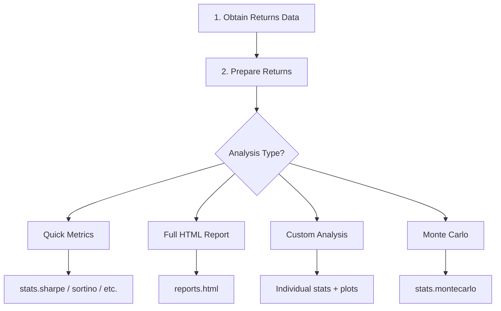
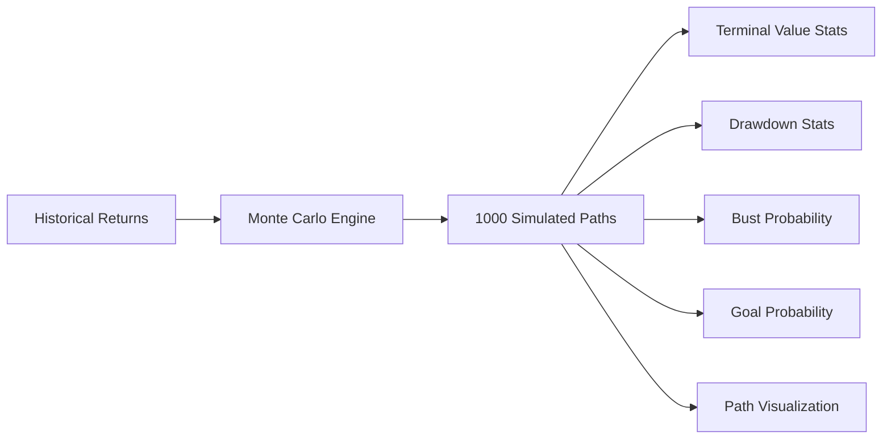

# QuantStats Workflow

## Typical Analysis Workflow



## 1. Data Preparation

### From Returns Series

```python
import quantstats as qs
import pandas as pd

# Your strategy returns (daily)
returns = pd.Series(
    [0.01, -0.02, 0.03, -0.01, 0.02, ...],
    index=pd.date_range('2020-01-01', periods=252)
)

# Download benchmark
benchmark = qs.utils.download_returns("SPY")
```

### From Price Series

```python
# Convert prices to returns
prices = pd.Series([100, 101, 99, 102, ...])
returns = qs.utils.to_returns(prices)

# Or log returns
log_rets = qs.utils.to_log_returns(prices)
```

### Data Validation

```python
from quantstats.utils import validate_input

# Validates: not None, is Series/DataFrame, not empty, has datetime index
validate_input(returns)
```

## 2. Quick Metrics

```python
import quantstats as qs

# Individual metrics
print(f"Sharpe Ratio: {qs.stats.sharpe(returns):.2f}")
print(f"Sortino Ratio: {qs.stats.sortino(returns):.2f}")
print(f"Max Drawdown: {qs.stats.max_drawdown(returns):.2%}")
print(f"CAGR: {qs.stats.cagr(returns):.2%}")
print(f"Volatility: {qs.stats.volatility(returns):.2%}")
print(f"Calmar Ratio: {qs.stats.calmar(returns):.2f}")
print(f"Omega Ratio: {qs.stats.omega(returns):.2f}")
print(f"VaR (95%): {qs.stats.value_at_risk(returns):.2%}")
print(f"CVaR (95%): {qs.stats.conditional_value_at_risk(returns):.2%}")
print(f"Win Rate: {qs.stats.win_rate(returns):.2%}")
print(f"Kelly Criterion: {qs.stats.kelly_criterion(returns):.2%}")

# With benchmark
print(f"Alpha: {qs.stats.greeks(returns, benchmark)['alpha']:.4f}")
print(f"Beta: {qs.stats.greeks(returns, benchmark)['beta']:.4f}")
print(f"R-squared: {qs.stats.r_squared(returns, benchmark):.4f}")
print(f"Information Ratio: {qs.stats.information_ratio(returns, benchmark):.2f}")
print(f"Treynor Ratio: {qs.stats.treynor_ratio(returns, benchmark):.4f}")
```

## 3. Console Metrics Report

```python
# Full metrics table to console
qs.reports.metrics(returns, benchmark="SPY", mode="full")

# Basic mode (fewer metrics)
qs.reports.metrics(returns, mode="basic")

# Get as DataFrame
metrics_df = qs.reports.metrics(returns, benchmark="SPY", display=False)
```

## 4. Full HTML Report

```python
# Generate and save HTML report
qs.reports.html(
    returns,
    benchmark="SPY",
    output="strategy_report.html",
    title="My Strategy Performance",
    periods_per_year=252,    # daily data
    rf=0.04,                 # 4% risk-free rate
    compounded=True,
    match_dates=True         # align strategy and benchmark dates
)
```

The HTML report includes:
- Performance summary statistics
- Cumulative returns chart (strategy vs benchmark)
- Drawdown chart and underwater plot
- Monthly returns heatmap
- Distribution of returns
- Rolling Sharpe ratio
- Rolling volatility
- Rolling beta
- Worst drawdown periods table

## 5. Individual Visualizations

```python
# Snapshot (combined chart)
qs.plots.snapshot(returns, title="Strategy Snapshot")

# Drawdown analysis
qs.plots.drawdown(returns)
qs.plots.drawdowns_periods(returns)

# Returns analysis
qs.plots.daily_returns(returns)
qs.plots.returns(returns, benchmark)
qs.plots.log_returns(returns)

# Distribution
qs.plots.histogram(returns)
qs.plots.distribution(returns)

# Rolling metrics
qs.plots.rolling_sharpe(returns)
qs.plots.rolling_sortino(returns)
qs.plots.rolling_volatility(returns)
qs.plots.rolling_beta(returns, benchmark)

# Calendar view
qs.plots.monthly_heatmap(returns)
qs.plots.yearly_returns(returns)

# Earnings/cumulative
qs.plots.earnings(returns, start_balance=10000)
```

## 6. Monte Carlo Simulation



```python
# Run simulation
mc = qs.stats.montecarlo(returns, sims=1000, bust=-0.10, goal=0.50)

# Terminal value statistics
print(mc.stats)
# {'min': -0.32, 'max': 1.85, 'mean': 0.42, 'median': 0.38, ...}

# Drawdown statistics
print(mc.maxdd)
# {'min': -0.45, 'max': -0.05, 'mean': -0.18, ...}

# Probabilities
print(f"Bust probability (>10% drawdown): {mc.bust_probability:.1%}")
print(f"Goal probability (>50% return): {mc.goal_probability:.1%}")

# Confidence bands
lower, upper = mc.confidence_band(level=0.95)

# Specific percentile path
p5 = mc.percentile(5)
p95 = mc.percentile(95)

# Visualize
mc.plot()
```

## 7. Using Pandas Extension

```python
qs.extend_pandas()

# Now use methods directly on DataFrames/Series
returns.sharpe()
returns.sortino()
returns.max_drawdown()
returns.cagr()
returns.volatility()
returns.monthly_returns()
returns.to_drawdown_series()

# Plotting
returns.plot_snapshot()
returns.plot_drawdown()
returns.plot_monthly_heatmap()

# Full report
returns.metrics()

# Conversions
prices.to_returns()
prices.to_log_returns()
returns.to_prices()
```

## 8. Comparing Multiple Strategies

```python
# Compare two strategies
comparison = qs.stats.compare(strategy_a, strategy_b)

# Side-by-side metrics
qs.reports.metrics(
    returns=pd.DataFrame({
        'Strategy A': strategy_a,
        'Strategy B': strategy_b
    }),
    benchmark="SPY"
)
```

## 9. Custom Periods and Configurations

```python
# Monthly data (12 periods per year)
qs.stats.sharpe(monthly_returns, periods=12)
qs.stats.cagr(monthly_returns, periods=12)

# With risk-free rate
qs.stats.sharpe(returns, rf=0.05)

# Non-compounded (sum-based)
qs.reports.html(returns, compounded=False)
```

## Output Formats

| Function | Output |
|----------|--------|
| `stats.*` | float or pd.Series |
| `reports.metrics()` | Console table or pd.DataFrame |
| `reports.html()` | HTML file or browser display |
| `plots.*()` | matplotlib Figure/Axes |
| `stats.montecarlo()` | MonteCarloResult object |

---
## See Also
- [README](README.md) — Project overview and quick start
- [Architecture](architecture.md) — System design and components
- [State Management](state-management.md) — State lifecycle and data models
- [Development](development.md) — Development guide and best practices
